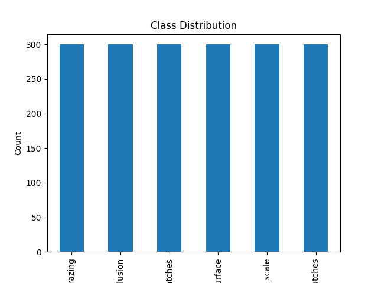
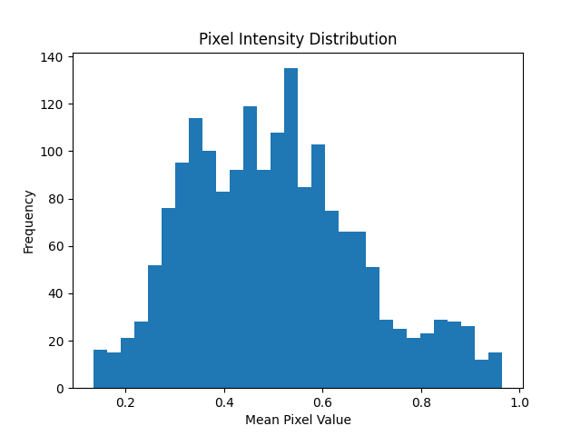
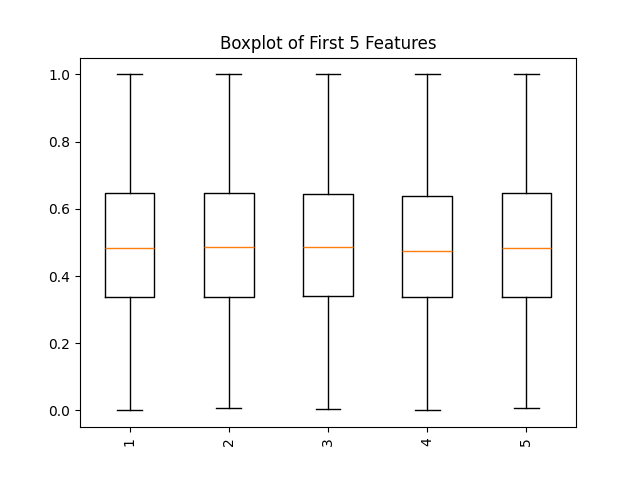
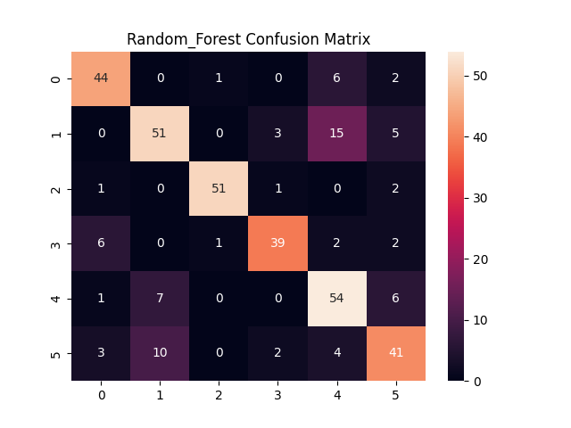
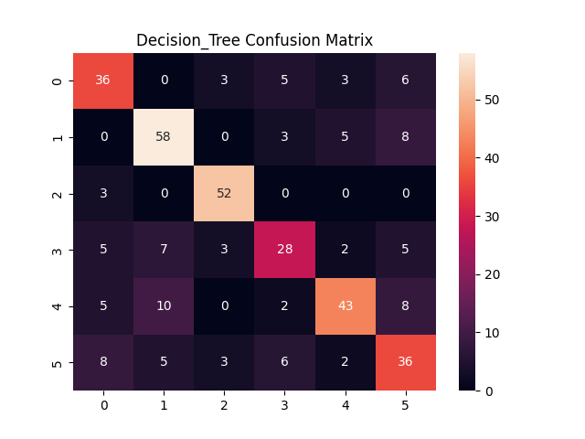
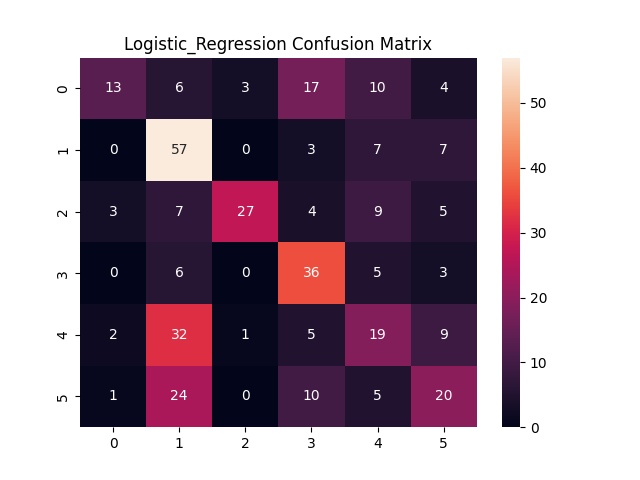
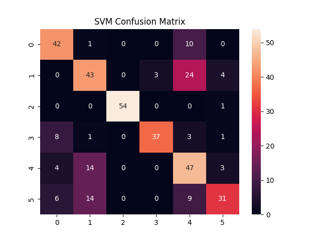
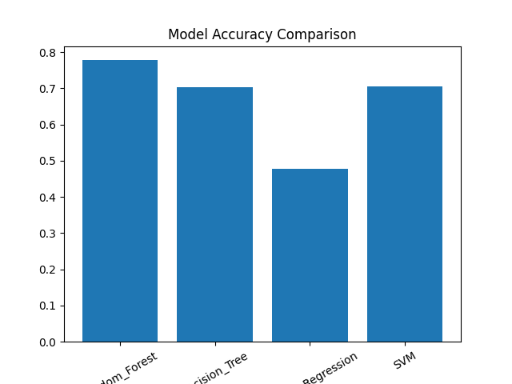
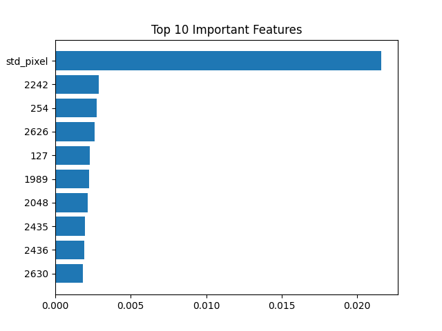

# 🔍 Quality Control: Defect Detection in Manufacturing Images

---

## Team Members

| Name | Reg No |
| --- | --- |
| Archana T | 253205 |
| Gokul A R | |
| Krishnendhu M S | |

## 👥 Team

| Member | Role |
|--------|--------|
| Archana T | Completed Exploratory Data Analysis (EDA) to understand the dataset, identify patterns, and prepare data for model development. Generated and organized project outputs and contributed to creating the project presentation (PPT). Also assisted in updating and improving the `README.md` file with project details and documentation.|
 


---

## 📌 Project Overview

This project focuses on building a machine learning-based system to automatically detect surface defects in manufacturing images. The aim is to enhance quality control by reducing manual inspection and improving accuracy.

---

## 🎯 Problem Statement

In manufacturing industries, maintaining product quality is critical. Traditional inspection methods rely on manual observation, which is time-consuming, inconsistent, and prone to human error.

This project develops an automated defect detection system that classifies surface defects such as:

* Crazing
* Inclusion
* Patches
* Pitted Surface
* Rolled-in Scale
* Scratches
  

---

## 🌍 Real-World Motivation

Surface defects can lead to product failure, financial losses, and safety risks. Manual inspection is inefficient for large-scale production.

An automated system ensures:

* Faster inspection
* Consistent results
* Reduced human error
* Scalable quality control

---

## 🤖 Why Automation is Needed

* High-speed inspection
* Improved accuracy
* Reduced labor cost
* Real-time defect detection
* Better decision-making

---

## ✨ Key Features

* Automated defect classification using ML
* Multiple model comparison
* Feature-based image analysis
* Interactive Streamlit web app
* Visual analytics (EDA + performance plots)

---

## 📊 Dataset

* **Name:** NEU Surface Defect Database
* **Total Images:** 1800
* **Classes:** 6 defect types
* Each class contains 300 images

---

## ⚙️ Methodology

### 🔹 Data Preprocessing

* Image resizing (64×64)
* Normalization
* Flattening

### 🔹 Feature Engineering

* Mean pixel value
* Standard deviation
* Edge detection (Canny)

### 🔹 Models Used

* Random Forest
* Decision Tree
* Logistic Regression
* Support Vector Machine (SVM)

---

## 📈 Model Evaluation

The performance of the models was evaluated using:

* **Accuracy Score**
* **Precision**
* **Recall**
* **F1-Score**
* **Classification Report**
* **Confusion Matrix**

---

## 📊 Model Performance

| Model               | Accuracy |
| ------------------- | -------- |
| Random Forest       | 78%      |
| SVM                 | 70%      |
| Logistic Regression | 48%      |
| Decision Tree       | 70%      |

👉 **Best Model: Random Forest**

**Reason:** Random Forest performs best due to its ensemble nature, reducing overfitting and handling feature variability effectively.

---

## 🧠 Model Explainability

Feature importance was analyzed using Random Forest to identify the most influential features contributing to predictions.

---

## 🚀 Deployment

The model is deployed using **Streamlit**, allowing users to:

* Upload an image
* Automatically extract features
* Predict defect type in real-time
* Streamlit: https://defect-detection-ml-vhi9bphk8zxpscrfrh5gte.streamlit.app/
---

## 📸 Outputs

## 📊 Exploratory Data Analysis

### 📊 Class Distribution



### 📈 Histogram



### 📦 Boxplot



---

## 🔹 Model Evaluation Visuals

### Confusion Matrices






### Model Comparison



### Feature Importance



---

## 📸 Application Screenshot


---

## 🛠️ How to Run the Project

### 1. Clone Repository

```
git clone https://github.com/gokulaards25-lab/defect-detection-ml.git
cd defect_detection
```

### 2. Install Requirements

```
pip install -r requirements.txt
```

### 3. Run Application

```
streamlit run app.py
```

---

## 📂 Project Structure

```
defect_detection/
 ├── notebooks/
 │    ├── eda_analysis.ipynb
 │    └── model_training.ipynb
 ├── src/
 ├── data/
 ├── models/
 │    └── model.pkl
 ├── outputs/
 │    └── plots/
 ├── app.py
 ├── requirements.txt
 └── README.md
```

---

## 📊 Results

* Random Forest achieved the highest accuracy (~78%)
* SVM performed well with slightly lower accuracy
* Decision Tree showed signs of overfitting
* Logistic Regression performed moderately

---

## 🔮 Future Work

* Implement deep learning models (CNN)
* Improve feature extraction techniques
* Deploy on cloud for large-scale industrial use
* Integrate real-time camera-based inspection

---

## 👥 Team Members & Contributions

| Name        | Contribution                                    |
| ----------- | ----------------------------------------------- |
| Archana     | Feature Engineering & EDA (feature/eda)         |
| Krishnendhu | Model Training & Evaluation (feature/model)     |
| Gokul       | Deployment & Streamlit App (feature/deployment) |

---

## 🔀 GitHub Workflow

* Feature-based branching strategy:

  * feature/eda
  * feature/model
  * feature/deployment
* Version control using Git and GitHub

---

## 📌 Conclusion

This project demonstrates how machine learning can automate defect detection in manufacturing, improving efficiency, accuracy, and scalability while reducing dependency on manual inspection.

---

## 🙌 Acknowledgements

* NEU Surface Defect Database
* Scikit-learn & Open-source community


